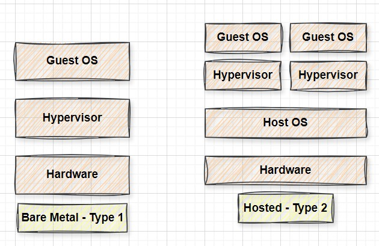

# Introduction to Virtualization 🖥️

`Virtualization` revolutionizes computing by allowing multiple virtual machines (VMs) to run on a single physical server, each with its own operating system and applications. This increases `efficiency`, `reduces costs`, and makes `scaling easier`.

## Traditional Way 🛠️

In the past, each server was dedicated to a single application, with its own operating system. This approach wasted resources, was costly, and made management complex.

## Virtualization Way 🚀

With `virtualization`, a single physical server runs a `hypervisor`, creating multiple virtual machines. Each VM runs its own operating system and application, just like the traditional setup, but with greater `flexibility` and `efficiency`. The hypervisor manages resources, making it easy to scale and manage applications.

### The Benefits of Virtualization 🌟

So, what makes virtualization so powerful? For starters, it offers:

- **Scalability** 📈: Quickly scale up or down to meet changing demand.
- **Flexibility** 🔄: Run a wide range of applications and operating systems on a single server.
- **Efficiency** ⚡: Make the most of computing resources.
- **Cost savings** 💰: Pay only for the resources you use.
- **Hardware consolidation** 🖥️: Combine multiple physical servers into fewer machines, reducing hardware costs.
- **Improved resource utilization** 📊: Optimize the use of computing resources.
- **Enhanced security** 🔒: Isolate applications in separate VMs to improve security.
- **Simplified management** 🧩: Centralize management of resources for easier maintenance and updates.

## Types of Virtualization 🖥️

`Virtualization` comes in various forms, each serving a unique purpose. Let's explore the most common types:

### Server Virtualization 🖥️

`Server virtualization` involves partitioning a physical server into multiple virtual servers, each running its own operating system and applications. This improves server utilization and reduces hardware costs.

### Network Virtualization 🌐

`Network virtualizatio`n` abstracts physical network resources into virtual networks. It allows for more efficient network management and improves scalability and flexibility.

### Storage Virtualization 📦

`Storage virtualization` combines multiple physical storage devices into a single virtual storage pool. It simplifies storage management and improves resource utilization.

### Desktop Virtualization 💻

`Desktop virtualization` allows users to run desktop environments on a centralized server. It enables remote access to desktops and improves security and management.

### Application Virtualization 📲

`Application virtualization` allows applications to run in environments separate from the underlying hardware and operating system. This makes it easier to manage and deploy applications across different devices and operating systems.

These types of virtualization help businesses `optimize resources`, `improve flexibility`, and `enhance security` across their IT infrastructure.

## Virtualization Technologies ⚙️

Let's see how this actually works:

1. **Hypervisors** 🛠️
   Hypervisors are software that creates and manages virtual machines. They can be classified into two types:
   - **Type 1 (Bare-Metal):** Runs directly on the `physical hardware`.
   - **Type 2 (Hosted):** Runs on a `host operating system`.

     

2. **Containers** 🐳
   `Containers` are lightweight virtualization technologies that package applications and their dependencies into a `single unit`. They provide isolation and portability, making it easy to deploy applications across different environments.

   

## Conclusion 🎯

In conclusion, `virtualization` is a transformative technology that revolutionizes the way we use computing resources. By enabling `efficient resource utilization`, `scalability`, and `flexibility`, virtualization plays a crucial role in modern IT infrastructure and cloud computing. Understanding the various types of virtualization and their benefits allows us to unlock the full potential of computing infrastructure, `driving innovation` and `efficiency` in `digital world`.

## Further Reading 🔍

- [AWS: What is Virtualization?](https://aws.amazon.com/what-is/virtualization/)
- [IBM: Virtualization](https://www.ibm.com/topics/virtualization)
- [Microsoft Azure: What is Virtualization?](https://azure.microsoft.com/en-in/resources/cloud-computing-dictionary/what-is-virtualization)
- [VMware: Virtualization](https://www.vmware.com/solutions/cloud-infrastructure/virtualization)
